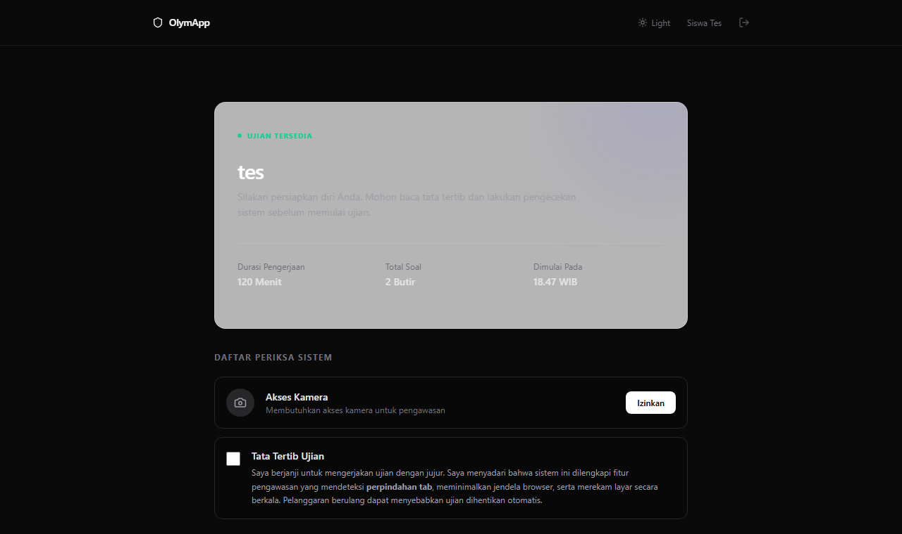
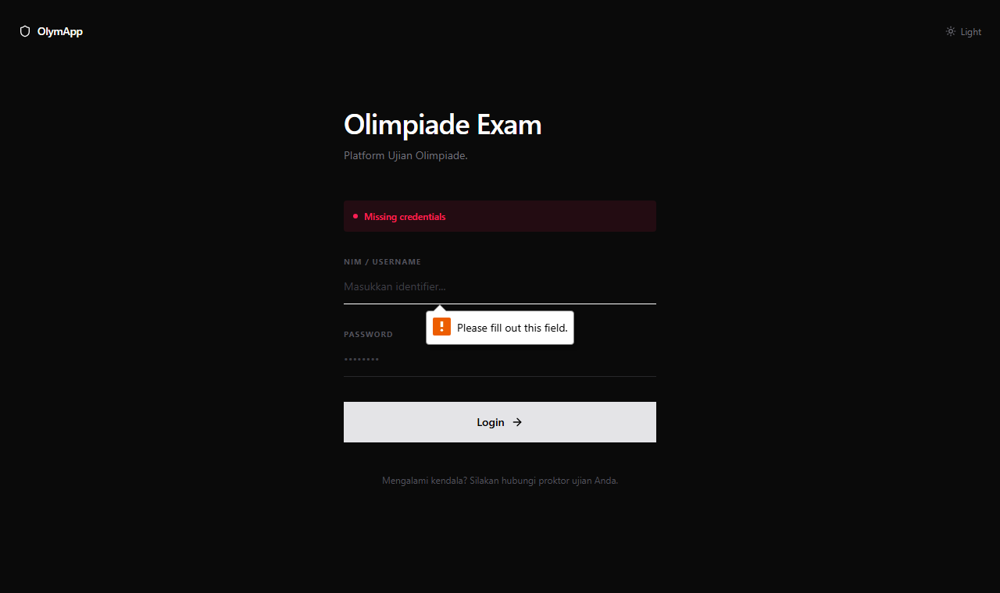
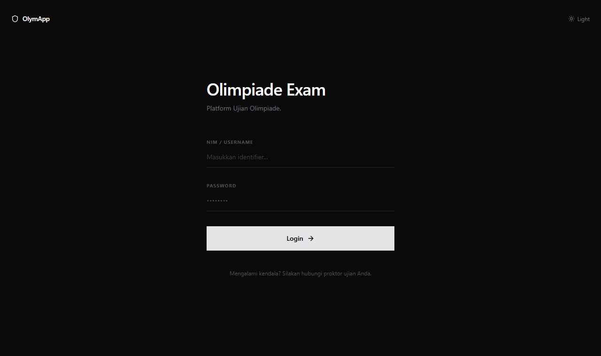

# 🏆 OlymApp — Modern Academic Olympiad & Secure Online Examination Platform

[](https://olympiade-app-kappa.vercel.app/login)
[](https://nextjs.org)
[](https://www.typescriptlang.org/)
[](https://tailwindcss.com/)
[](https://www.prisma.io/)

> 🌐 **Live Website**: [https://olympiade-app-kappa.vercel.app/login](https://olympiade-app-kappa.vercel.app/login)

---

## 🌟 Executive Summary

**OlymApp** is an enterprise-grade, high-concurrency online examination and academic competition platform engineered with **Next.js 16 (Turbopack)**, **TypeScript**, **PostgreSQL (Supabase)**, and **Prisma ORM**. 

Engineered specifically to solve academic integrity vulnerabilities and proctoring bottlenecks in digital assessments, OlymApp features **Safe Exam Browser (SEB) verification**, **live camera proctoring**, **automated violation telemetry**, **real-time session lockouts**, and **LaTeX/KaTeX mathematical formula rendering**.

---

## 🔑 Demo Access Credentials

You can explore all 3 role workspaces directly on the live website:

| Role | Username / Identifier | Password | Core Focus Area |
| :--- | :--- | :--- | :--- |
| **🎓 Student** | `student@olym.app` | `password123` | Camera activation, anti-cheat state tracker, KaTeX formula support, timer |
| **🛡️ Admin** | `admin@olym.app` | `password123` | Real-time proctoring command center, violation timeline, session lock/unlock |
| **👑 Superadmin** | `superadmin@olym.app` | `password123` | Global system health diagnostics, emergency maintenance switch, admin delegation |

---

## 🎬 Core Role Workflows & Live Visual Demonstrations

### 1. 🎓 Student Experience: Camera & Proctoring Activation
Upon entering an assessment, students undergo instant hardware verification. The proctoring engine requests webcam access, initializes the live video stream widget, and tracks focus visibility throughout the exam.



---

### 2. 🛡️ Admin Command Center: Live Proctoring & Telemetry Inspection
Admins monitor candidate sessions in real time. Clicking on any participant opens a granular violation timeline detailing tab switches, warning counts, and remote session lock controls.



---

### 3. 👑 Superadmin Control: System Health & Maintenance Governance
Superadmins govern global infrastructure health, inspect database connection states, manage privileged administrator accounts, and trigger emergency maintenance switches.



---

## ✨ Key Platform Features

- 🛡️ **Anti-Cheat & SEB Integration**: Safe Exam Browser (SEB) validation via SHA-256 header hash checks, tab-switch monitors, and automated violation logging.
- ⚡ **Real-Time Command Center**: Live telemetry stream with remote session freeze/unfreeze controls.
- 📊 **Instant Grading & Analytics**: Automated scoring with one-click export to **PDF** and **Excel (.xlsx)**.
- 📐 **Scientific & Math Engine**: Native KaTeX integration rendering multi-line equations and complex formulas with zero layout shift.
- 🎨 **Adaptive Glassmorphism UI**: Unified Dark & Light theme state synchronization across all modules.

---

## 🛠️ Tech Stack

- **Framework**: Next.js 16 (App Router & Turbopack)
- **Language**: TypeScript
- **Database & ORM**: PostgreSQL (Supabase Connection Pooler) + Prisma ORM
- **Authentication**: NextAuth.js (JWT Strategy)
- **Styling**: Tailwind CSS 4 + Glassmorphism UI System
- **Math Rendering**: KaTeX & React-KaTeX
- **Reporting**: jsPDF, jspdf-autotable, XLSX
- **Deployment**: Vercel CI/CD Pipeline

---

## 🚀 Getting Started Locally

### 1. Clone the repository
```bash
git clone https://github.com/ArloDel/olympiade-app.git
cd olympiade-app
```

### 2. Install dependencies
```bash
npm install
```

### 3. Setup environment variables
Create a `.env` file in the root directory:
```env
DATABASE_URL="your-supabase-pooled-connection-string"
DIRECT_URL="your-supabase-direct-connection-string"
NEXT_PUBLIC_SUPABASE_URL="your-supabase-url"
NEXT_PUBLIC_SUPABASE_PUBLISHABLE_KEY="your-supabase-anon-key"
SUPABASE_SERVICE_ROLE_KEY="your-supabase-service-role-key"
NEXTAUTH_SECRET="your-nextauth-secret"
NEXTAUTH_URL="http://localhost:3000"
```

### 4. Push database schema & generate client
```bash
npx prisma db push
```

### 5. Run development server
```bash
npm run dev
```

Open [http://localhost:3000](http://localhost:3000) with your browser.

---

## 📄 License
This project is open source and available under the [MIT License](LICENSE).
