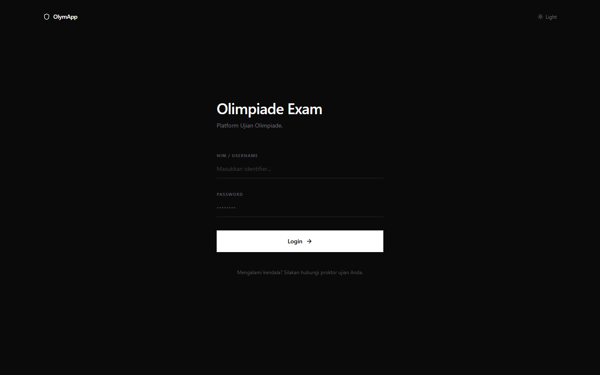
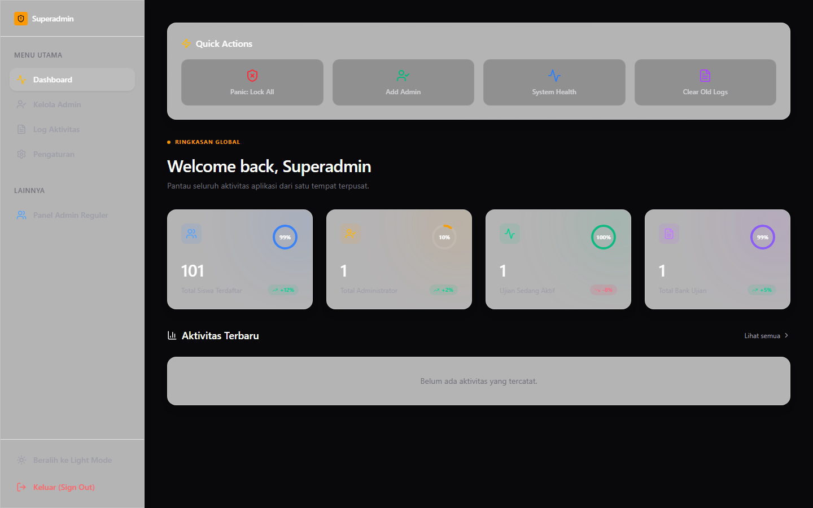
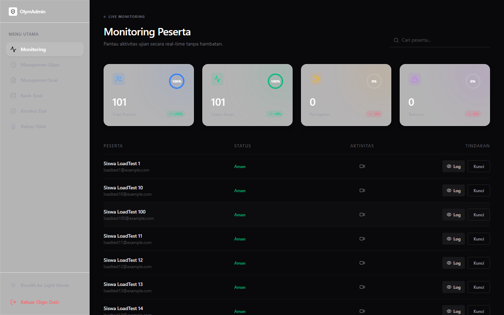
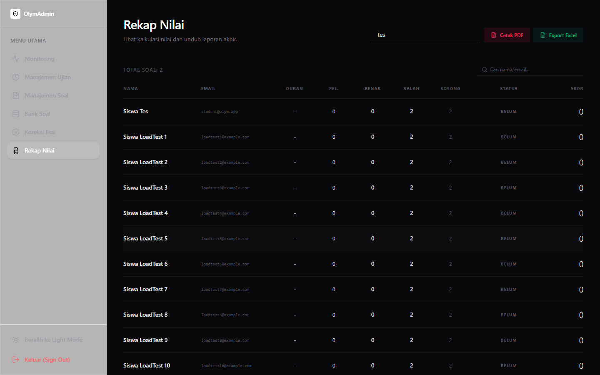
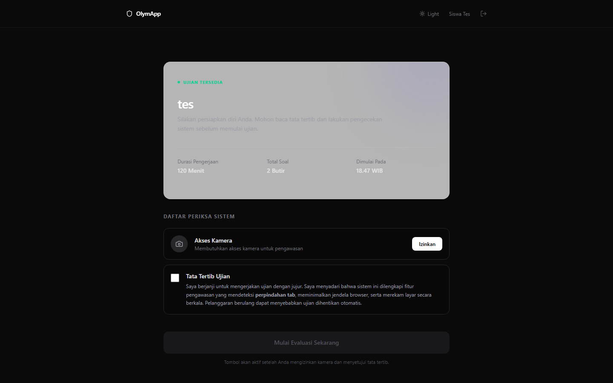

# 🏆 OlymApp — Modern Academic Olympiad & Secure Online Examination Platform

[](https://olympiade-app-kappa.vercel.app/login)
[](https://nextjs.org)
[](https://www.typescriptlang.org/)
[](https://tailwindcss.com/)
[](https://www.prisma.io/)

> **Live Application**: [https://olympiade-app-kappa.vercel.app/login](https://olympiade-app-kappa.vercel.app/login)

---

## 🌟 Executive Summary

**OlymApp** is an enterprise-grade, high-concurrency online examination and academic competition platform engineered with **Next.js 16 (Turbopack)**, **TypeScript**, **PostgreSQL (Supabase)**, and **Prisma ORM**. 

Engineered specifically to solve academic integrity vulnerabilities and proctoring bottlenecks in digital assessments, OlymApp features **Safe Exam Browser (SEB) verification**, **live proctoring with automated violation telemetry**, **real-time session lockouts**, and **LaTeX/KaTeX mathematical formula rendering**.

---

## 🔑 Demo Access

You can test all 3 permission levels directly on the live deployment. (Credentials are provided separately).

| Role | Primary Capabilities |
| :--- | :--- |
| **👑 Superadmin** | Global system health telemetry, maintenance kill-switch, admin delegation, audit logs |
| **🛡️ Admin** | Live exam proctoring room, session lock/unlock, question bank, PDF & Excel export |
| **🎓 Student** | Exam runner, KaTeX formula support, anti-cheat state tracker, live countdown timer |

---

## 📸 Full Demo & Screenshots

### 🎥 Login Process Demo


### 1. Login Page


### 2. Superadmin Dashboard


### 3. Admin Command Center


### 4. Admin Results Export


### 5. Student Dashboard


---

## ✨ Key Features

- 🛡️ **Anti-Cheat & SEB Integration**: Enforces Safe Exam Browser (SEB) via SHA-256 header hash validation, tab-switch monitoring, and automated violation logging.
- ⚡ **Real-Time Admin Command Center**: Track student activity, review infraction timelines, and remotely lock/unlock exam sessions in real time.
- 📊 **Instant Grading & Analytics**: Automated scoring, item-by-item analysis, and one-click report export to **PDF** and **Excel (.xlsx)**.
- 🎨 **Premium Glassmorphism UI**: Ultra-clean, modern dark & light mode interface with responsive layout and LaTeX/KaTeX formula support.
- 👥 **Multi-Role Access Control**: Granular permission system separating Superadmins, Admins, and Students via secure JWT authentication.

---

## 🛠️ Tech Stack

- **Framework**: Next.js 16 (App Router & Turbopack)
- **Language**: TypeScript
- **Database & ORM**: PostgreSQL (Supabase Connection Pooler) + Prisma ORM
- **Authentication**: NextAuth.js (JWT Strategy)
- **Styling**: Tailwind CSS 4 + Glassmorphism UI System
- **Math Rendering**: KaTeX & React-KaTeX
- **Report Generation**: jsPDF, jspdf-autotable, XLSX
- **Deployment**: Vercel CI/CD Pipeline

---

## 🚀 Getting Started Locally

### 1. Clone the repository
```bash
git clone https://github.com/ArloDel/olympiade-app.git
cd olympiade-app
```

### 2. Install dependencies
```bash
npm install
```

### 3. Setup environment variables
Create a `.env` file in the root directory:
```env
DATABASE_URL="your-supabase-pooled-connection-string"
DIRECT_URL="your-supabase-direct-connection-string"
NEXT_PUBLIC_SUPABASE_URL="your-supabase-url"
NEXT_PUBLIC_SUPABASE_PUBLISHABLE_KEY="your-supabase-anon-key"
SUPABASE_SERVICE_ROLE_KEY="your-supabase-service-role-key"
NEXTAUTH_SECRET="your-nextauth-secret"
NEXTAUTH_URL="http://localhost:3000"
```

### 4. Push database schema & generate client
```bash
npx prisma db push
```

### 5. Run development server
```bash
npm run dev
```

Open [http://localhost:3000](http://localhost:3000) with your browser to see the result.

---

## 📄 License
This project is open source and available under the [MIT License](LICENSE).
